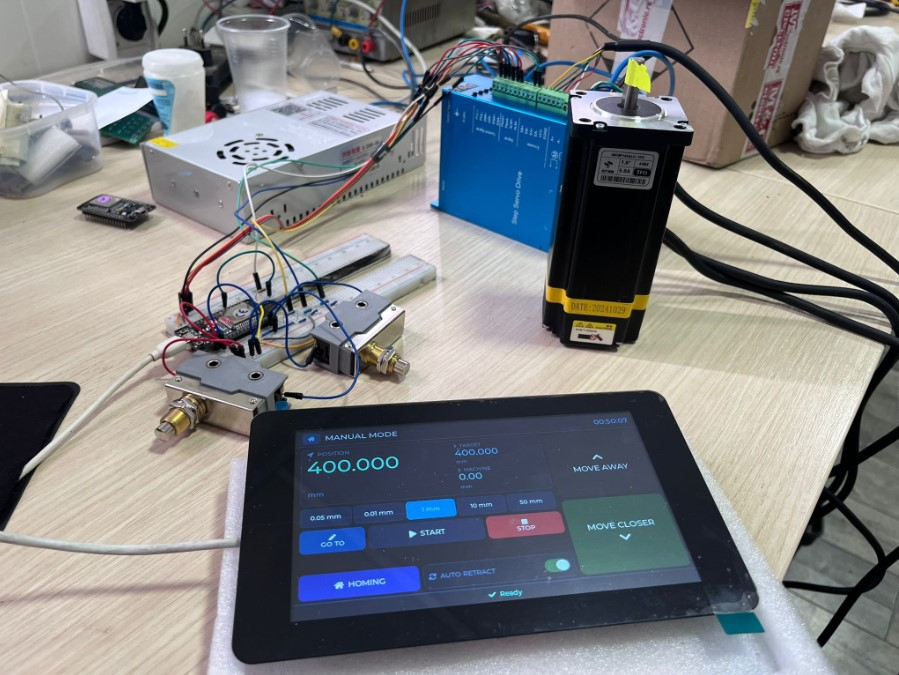
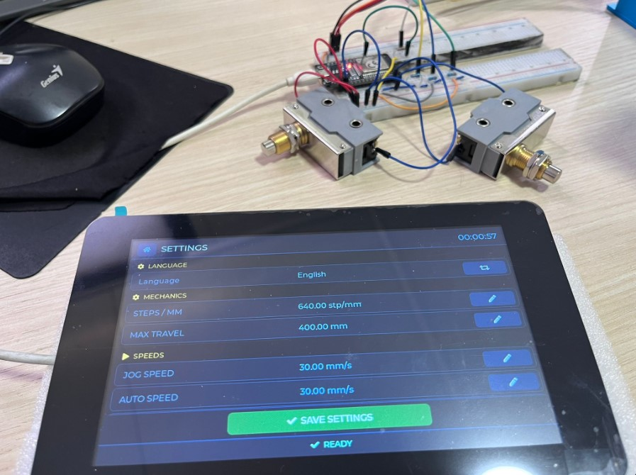
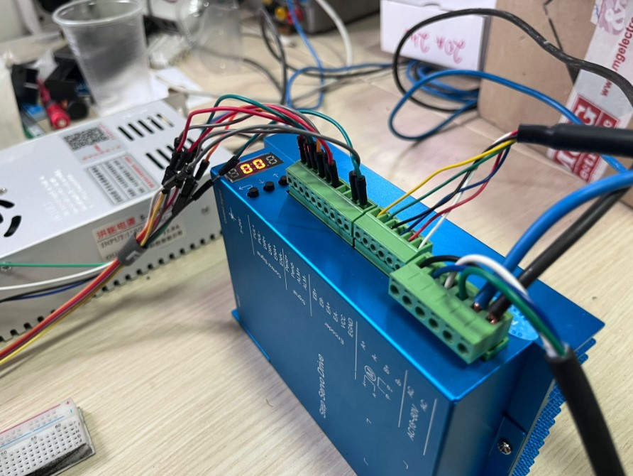

# CNC Press Brake Back-Gauge Upgrade (Dual ESP32)

End-to-end embedded control system for a CNC press brake back-gauge, built as a real hardware project and portfolio showcase.



| HMI Settings Screen | Step Servo Drive Wiring |
|---|---|
|  |  |

## 1. Project Purpose

This project upgrades a press brake back-gauge workflow from basic manual control to a structured digital system with:

- a dedicated motor controller node
- a dedicated touchscreen HMI node
- stable machine state synchronization
- operator-friendly manual and automatic workflows

The goal is practical industrial value: repeatable positioning, safer operation flow, and faster setup for serial bending tasks.

## 2. What This Demonstrates

This repository demonstrates practical firmware and automation engineering skills:

- embedded architecture design on real hardware
- machine state management and fault handling
- touchscreen HMI design for operators
- communication protocol usage (ESP-NOW)
- persistence of production settings and recipes
- iterative debugging and performance tuning

## 3. System Architecture

Two ESP32 devices are used:

1. `motor_brain/` (ESP32 WROOM-32)
- controls stepper motion (step/dir)
- processes homing, limits, bend sensor, alarms
- executes low-level safety and movement logic

2. `motor_test/` (Waveshare ESP32-S3 Touch LCD 7)
- provides full touchscreen user interface (LVGL)
- sends commands/settings to motor node
- manages programs, materials, and operator workflows

Communication between nodes is done via ESP-NOW.

## 4. Main Functionalities

### Manual Mode

- jog control with selectable/customizable increments
- absolute move target entry
- homing trigger
- auto-retract enable/disable

### Auto Mode

- step-by-step program execution
- bend sensor driven cycle logic
- retract and pause handling
- part counting

### Programs and Materials

- create/edit/delete materials (thickness + offset)
- create/edit/delete programs (named steps)
- assign material to each program

### Settings and Persistence

- machine parameters (speeds, travel, homing, retract)
- language selection (Serbian/English)
- saved persistently in LittleFS

### Alarms and Recovery

- alarm status visibility on HMI
- reset alarm flow
- homing-required safety path after reset

## 5. Repository Structure

- `motor_brain/`
  - low-level motor firmware
  - stepper control, sensor handling, alarm logic, ESP-NOW motor side

- `motor_test/`
  - HMI firmware
  - LVGL screens, storage, ESP-NOW HMI side, UI workflow logic

- `docs/`
  - `WIRING_GUIDE.md` (wiring guide)
  - `WIRING_GUIDE_LEGACY.txt` (original field notes)
  - `hmi/hmi_v2.html` (HMI prototype view)
  - `images/` (hardware and bench photos)

## 6. Documentation for Replication

If someone wants to build the same setup, start here:

1. `docs/WIRING_GUIDE.md`
2. `docs/WIRING_GUIDE_LEGACY.txt`

## 7. Hardware Stack

| Component | Details |
|---|---|
| Motor controller MCU | ESP32 WROOM-32 |
| HMI MCU | Waveshare ESP32-S3 Touch LCD 7 (800×480, capacitive touch) |
| Motor | Nema23 closed-loop stepper (step-servo, 12.5 Nm) |
| Motor driver | Step Servo Drive (step/dir input, AC/DC 20-50V) |
| Home (zero) switch | Mechanical limit switch via optocoupler |
| Bend sensor | Mechanical limit switch triggered by press beam, via optocoupler |
| Power supply | 24V DC switching supply for logic; driver powered separately |
| Emergency stop | Hardware wired directly to driver enable — independent of firmware |

## 8. Key Technical Decisions

**Why dual ESP32 nodes instead of one?**  
Separating motor control from HMI keeps real-time step generation isolated from UI rendering. LVGL screen redraws and touch events must not interfere with stepper pulse timing.

**Why ESP-NOW instead of WiFi or BLE?**  
ESP-NOW has sub-millisecond latency, requires no router or infrastructure, pairs by MAC address, and works reliably in industrial environments with RF interference. It was the simplest low-latency option available natively on ESP32.

**Why LVGL instead of a pre-built dashboard?**  
The operator workflow required custom screen layouts, a numpad, alarm views, and program/material management — none of which map cleanly to generic dashboard widgets. LVGL gives full control over layout and interaction at the cost of more implementation work.

**Why LittleFS for persistence?**  
Machine settings, materials, and programs must survive power cycles. LittleFS on the HMI node provides a simple, reliable key-value JSON store without external EEPROM hardware.

## 9. Build and Flash

Prerequisites:

- VS Code
- PlatformIO extension

Default serial ports used in this project:

- Motor controller: `COM3`
- HMI controller: `COM5`

Commands (run inside each project folder):

```bash
pio run
pio run -t upload --upload-port COM3   # motor_brain
pio run -t upload --upload-port COM5   # motor_test
```

## 10. Quick Bring-Up Checklist

1. Flash `motor_brain` first.
2. Flash `motor_test` second.
3. Boot both boards.
4. Open HMI and verify live position/status updates.
5. Run homing.
6. Test manual jog.
7. Test one short auto program with bend/retract cycle.

## 11. Demo Walkthrough

1. Show architecture (dual ESP32 roles).
2. Show Manual mode (jog + go-to position).
3. Show Settings and language switch (SR/EN) with persistence.
4. Show Materials + Programs editing.
5. Run Auto cycle and explain state transitions.
6. Trigger/reset alarm and explain recovery behavior.

## 12. Safety Notes

- Test on reduced speed and safe mechanical clearance first.
- Verify limit switch wiring and transitions before full-range motion.
- Keep emergency stop hardware path independent from UI actions.

## 13. Current Status

Working prototype tested on real hardware, with ongoing iterative improvements for production robustness and operator UX.

## 14. Author

Aleksandar Zdravkovic  
Embedded/automation practical portfolio project focused on CNC manufacturing applications.
